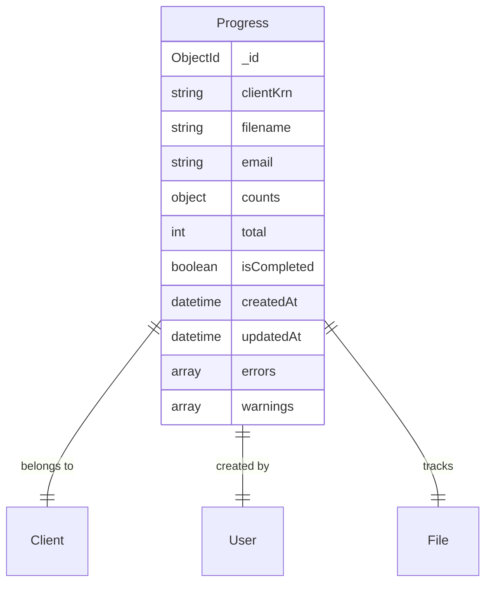
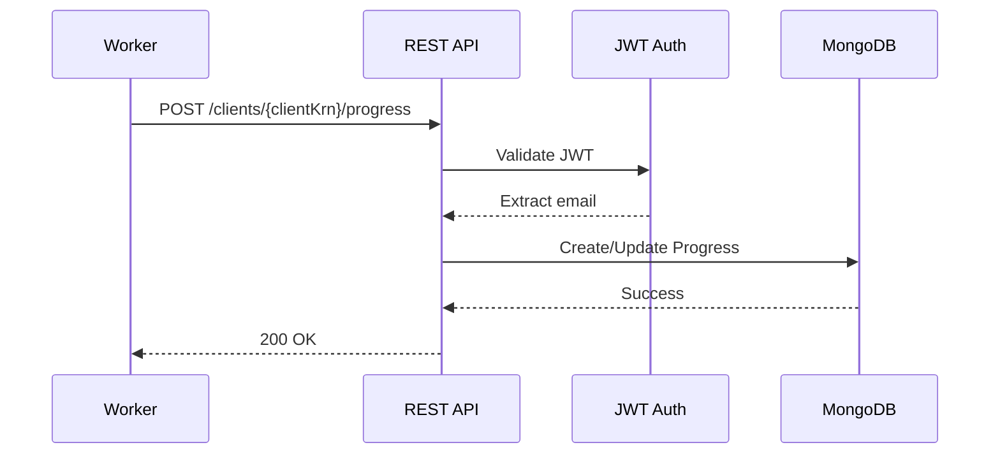
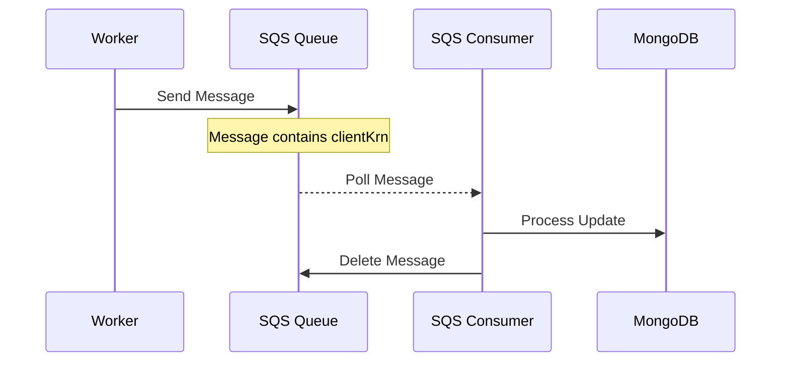
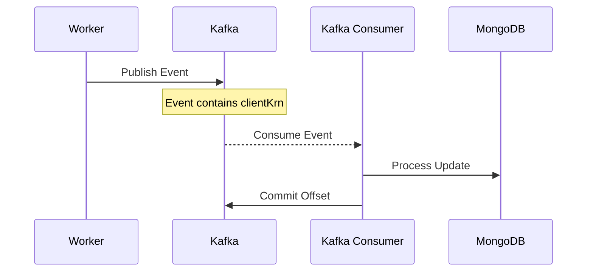
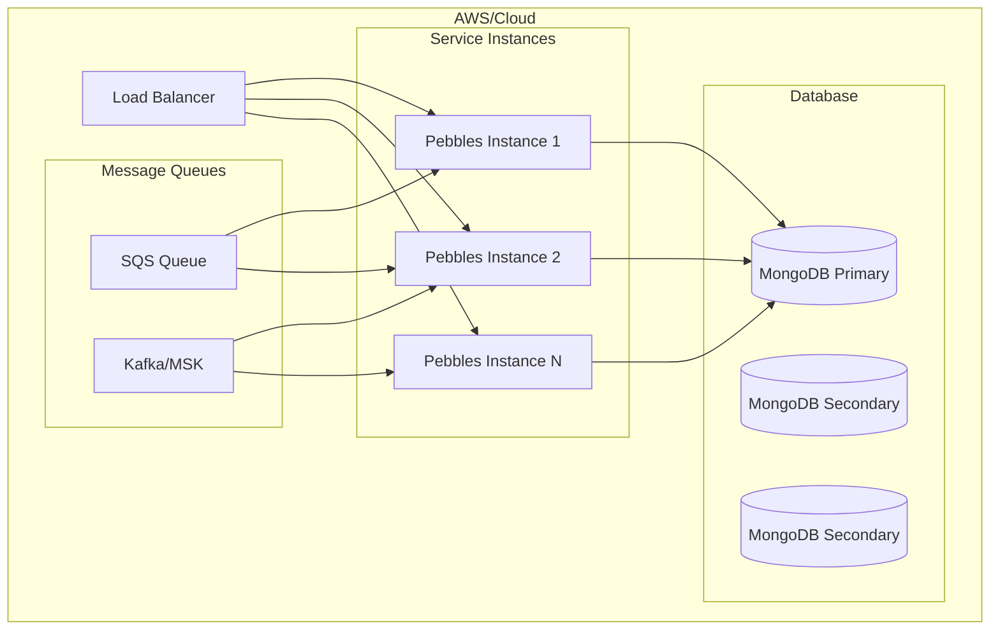

# Pebbles Multi-Tenant Architecture

## Overview

Pebbles is a multi-tenant file processing progress tracking service that provides complete data isolation between clients while supporting multiple integration channels (REST API, SQS, Kafka).

## Architecture Diagram

```mermaid
graph TB
    subgraph "Client Applications"
        A1[Client 1 Workers]
        A2[Client 2 Workers]
        A3[Client N Workers]
    end
    
    subgraph "Integration Channels"
        B1[REST API<br/>/clients/{clientKrn}/progress]
        B2[SQS Queue]
        B3[Kafka Topic]
    end
    
    subgraph "Pebbles Service"
        C1[HTTP Server<br/>with JWT Auth]
        C2[SQS Consumer]
        C3[Kafka Consumer]
        D[Core Progress<br/>Processing Logic]
        E[MongoDB Driver]
    end
    
    subgraph "Data Storage"
        F[(MongoDB)]
        F1[Client 1 Data]
        F2[Client 2 Data]
        F3[Client N Data]
    end
    
    A1 --> B1
    A2 --> B2
    A3 --> B3
    
    B1 --> C1
    B2 --> C2
    B3 --> C3
    
    C1 --> D
    C2 --> D
    C3 --> D
    
    D --> E
    E --> F
    
    F --> F1
    F --> F2
    F --> F3
```

## Multi-Tenancy Design

### Client Isolation

Each client is identified by a unique `clientKrn` (Client KRN - Key Resource Name). All data operations are scoped to this identifier:

- **URL Structure**: `/clients/{clientKrn}/progress`
- **Database Indexes**: Compound indexes on `(clientKrn, filename, email)`
- **Query Isolation**: All queries automatically filtered by clientKrn

### Data Model



### Key Relationships

1. **Unique Progress Key**: `clientKrn + filename + email`
2. **Ownership**: First user to create progress owns it
3. **Client Boundary**: Progress records never cross client boundaries

## Integration Patterns

### 1. Direct REST API



### 2. SQS Queue Integration



### 3. Kafka Topic Integration



## Security Model

### Authentication
- **HTTP API**: JWT tokens required for POST operations
- **SQS/Kafka**: Messages must include email for ownership tracking

### Authorization
- **File Ownership**: Only the original creator can update progress
- **Client Isolation**: Operations restricted to client context
- **Public Read**: GET operations don't require authentication

## Database Schema

### Indexes
```javascript
// Unique compound index for multi-tenancy
db.progress.createIndex(
    { clientKrn: 1, filename: 1, email: 1 }, 
    { unique: true }
)

// Query optimization indexes
db.progress.createIndex({ clientKrn: 1, email: 1 })
db.progress.createIndex({ clientKrn: 1 })
```

### Sample Document
```json
{
    "_id": ObjectId("..."),
    "clientKrn": "krn:acme:client:123",
    "filename": "sales_data.csv",
    "email": "user@acme.com",
    "counts": {
        "done": 9500,
        "warn": 25,
        "failed": 10
    },
    "total": 10000,
    "isCompleted": false,
    "createdAt": "2024-01-01T10:00:00Z",
    "updatedAt": "2024-01-01T15:30:00Z",
    "errors": [
        {
            "line": 145,
            "message": "Invalid format"
        }
    ],
    "warnings": [
        {
            "line": 89,
            "message": "Deprecated field"
        }
    ]
}
```

## Scalability Considerations

### Horizontal Scaling
- **Stateless Services**: All components can be horizontally scaled
- **Load Balancing**: HTTP traffic can be distributed across instances
- **Consumer Groups**: Kafka supports multiple consumer instances
- **SQS Scaling**: Automatic with multiple consumers

### Performance Optimizations
- **Indexed Queries**: All common query patterns are indexed
- **Bulk Updates**: SQS and Kafka support batch processing
- **Connection Pooling**: MongoDB connection reuse

## Deployment Architecture



## Configuration

### Environment Variables

| Variable | Purpose | Default |
|----------|---------|---------|
| `MONGO_URI` | MongoDB connection string | `mongodb://localhost:27017/pebbles` |
| `PORT` | HTTP server port | `8081` |
| `SQS_ENABLED` | Enable SQS consumer | `false` |
| `SQS_QUEUE_URL` | SQS queue URL | - |
| `AWS_REGION` | AWS region | `us-east-1` |
| `KAFKA_ENABLED` | Enable Kafka consumer | `false` |
| `KAFKA_BOOTSTRAP_SERVERS` | Kafka brokers | - |
| `KAFKA_TOPIC_NAME` | Kafka topic | `progress-updates` |
| `KAFKA_GROUP_ID` | Consumer group | `pebbles-consumer` |

## Monitoring & Observability

### Key Metrics
- **API Latency**: Response times per endpoint
- **Queue Depth**: SQS/Kafka backlog
- **Error Rates**: Failed updates per client
- **Database Performance**: Query execution times

### Health Checks
- **HTTP**: `/health` endpoint
- **Database**: Connection pool status
- **Consumers**: Processing lag metrics

## Future Enhancements

1. **Rate Limiting**: Per-client request limits
2. **Webhooks**: Progress completion notifications
3. **Batch API**: Bulk progress updates
4. **GraphQL**: Alternative query interface
5. **Event Sourcing**: Complete audit trail